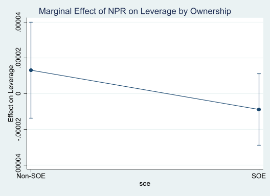
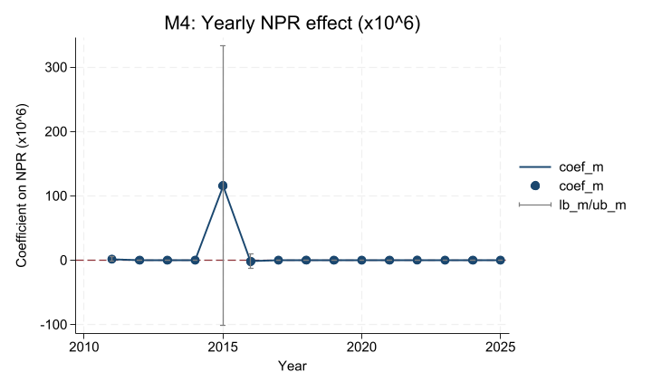
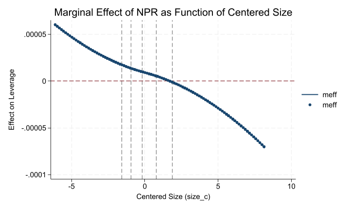
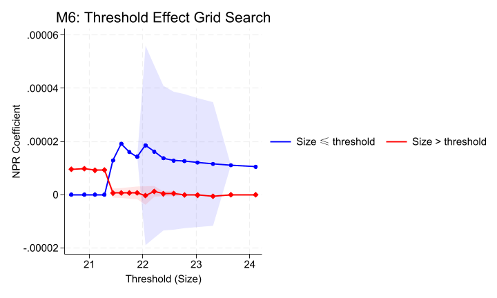

# M1-M3：基准回归与产权性质

M1-M3 的结果整体更接近权衡理论。`npr` 对杠杆的影响为正，但产权性质交互项不显著，说明差异方向存在，但证据不强。

# M4：时间变系数

M4 显示 2015 年前后波动最明显，说明利润率与杠杆关系会受到宏观政策环境影响。

# M5：函数系数

M5 显示 `npr` 的边际效应会随着企业规模扩大而持续下降，小企业与大企业的融资行为存在明显异质性。

# M6：门槛效应

M6 的网格搜索显示门槛值大致落在 `ln(Size)` 约 21.4-21.6 的区间，对应总资产约 20-25 亿元。

# IFE vs TWFE

IFE 结果已经成功估计并收敛。样本量为 43,026，`npr` 系数约为 $8.46\times10^{-8}$，`m2_growth` 系数约为 $-6.17\times10^{-9}$，两者都不显著。与 M1 相比，`npr` 系数明显缩小并接近 0，说明 TWFE 中看到的正向关系不够稳健。
